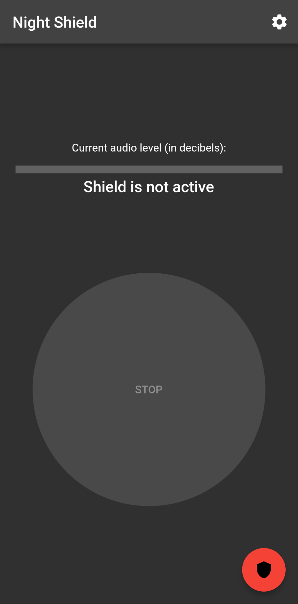
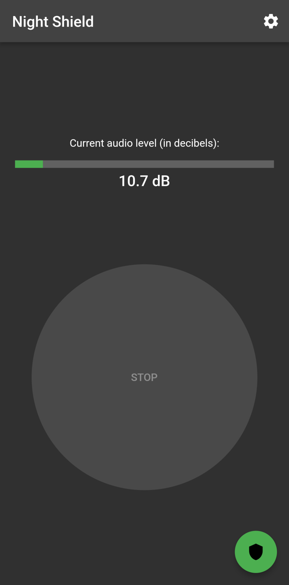
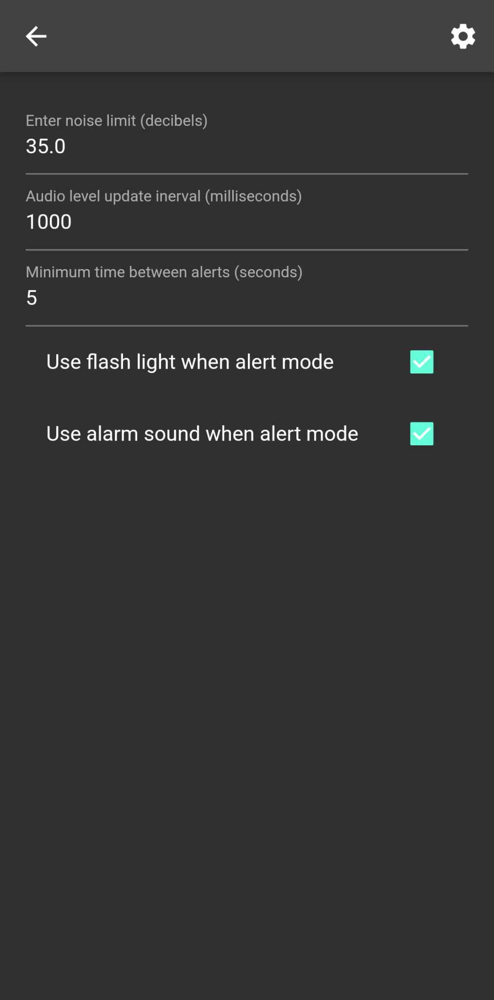

# NightShield

NightShield is an application that helps fight night terrors. It allows you to set a maximum sound level (in decibels) which, when reached, triggers an alert mode. This alert mode can be customized, but by default it will turn on your flashlight and start playing an alarm song. The goal is to detect when the user is in the grip of a night terror during their night, detecting the sound level and triggering effects to try to wake them up.

<p align="center">
 
 

</p>

## Getting Started

This project use Flutter. For the moment, it **only supports Android**. The minimum Android SDK supported version is **23**.

### Build

1. Download the [Flutter SDK](https://docs.flutter.dev/get-started/install)
2. Download the platform-specific SDK (either [Android SDK](https://developer.android.com/studio) or [iOS SDK](https://developer.apple.com/ios/))
3. Create a `local.properties` files in the `android/` directory :
```
sdk.dir=<PATH TO ANDROID SDK>
flutter.sdk=<PATH TO FLUTTER SDK>
flutter.buildMode=release
flutter.versionName=1.0.0
flutter.versionCode=3
flutter.minSdkVersion=21
```
4. Build the project using `flutter build apk` ([Android](https://docs.flutter.dev/deployment/android)) or `flutter build ipa` ([iOS](https://docs.flutter.dev/deployment/ios))

### Build icons

To run the [flutter_launcher_icons](https://pub.dev/packages/flutter_launcher_icons) to build icons :
```
flutter pub get
flutter pub run flutter_launcher_icons:main
```

## Signing

### Android

First, copy your key to `$PROJECT/android/app` folder.
Define these 4 parameters in the file `android/local.properties`:
```
signing.keyPath=..."      # Relative path
signing.storePassword=...
signing.keyAlias=...
signing.keyPassword=...
```

Then `Build -> Flutter -> Build APK`.

## License

This project is under MIT license. Please see the `LICENSE.TXT` file.

```
Copyright (c) 2022 Dorian Bachelot

Permission is hereby granted, free of charge, to any person obtaining
a copy of this software and associated documentation files (the
"Software"), to deal in the Software without restriction, including
without limitation the rights to use, copy, modify, merge, publish,
distribute, sublicense, and/or sell copies of the Software, and to
permit persons to whom the Software is furnished to do so, subject to
the following conditions:

The above copyright notice and this permission notice shall be
included in all copies or substantial portions of the Software.

THE SOFTWARE IS PROVIDED "AS IS", WITHOUT WARRANTY OF ANY KIND,
EXPRESS OR IMPLIED, INCLUDING BUT NOT LIMITED TO THE WARRANTIES OF
MERCHANTABILITY, FITNESS FOR A PARTICULAR PURPOSE AND
NONINFRINGEMENT. IN NO EVENT SHALL THE AUTHORS OR COPYRIGHT HOLDERS BE
LIABLE FOR ANY CLAIM, DAMAGES OR OTHER LIABILITY, WHETHER IN AN ACTION
OF CONTRACT, TORT OR OTHERWISE, ARISING FROM, OUT OF OR IN CONNECTION
WITH THE SOFTWARE OR THE USE OR OTHER DEALINGS IN THE SOFTWARE.

```